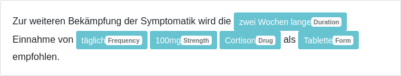

# GERNERMED++

## About
GERNERMED++ is the successor to [GERNERMED](https://github.com/frankkramer-lab/GERNERMED), an open neural named-entity-recognition (NER) model for German texts in medical natural language processing (NLP).

Key features:
 - Supported labels: *Drug*, *Strength*, *Frequency*, *Duration*, *Form*, *Dosage*
 - Improved **word alignment**, including improved tokenization for Pharao alignment
 - Introduction of **transfer-learning** for NER parsing
 - **Open, public access** to models

**Online Demo**: A demo page is available: [Demo](https://gernermedplusplus.misit-augsburg.de/); and HuggingFace (see Models section)

NER demonstration:  
<kbd></kbd>

## Models
The pretrained models can be retrieved from the following URLs:
- GottBERT-based: [model link](https://myweb.rz.uni-augsburg.de/~freijoha/GERNERMEDpp/GERNERMEDpp_GottBERT.zip)
- GermanBERT-based: [model link](https://myweb.rz.uni-augsburg.de/~freijoha/GERNERMEDpp/GERNERMEDpp_GermanBERT.zip)
- SpaCy (slim)-based: [model link](https://myweb.rz.uni-augsburg.de/~freijoha/GERNERMEDpp/GERNERMEDpp_SpaCy.zip)

The models are also available on the HuggingFace platform:
- GottBERT-based: [HuggingFace link](https://huggingface.co/jfrei/de_GERNERMEDpp_GottBERT)
- GermanBERT-based: [HuggingFace link](https://huggingface.co/jfrei/de_GERNERMEDpp_GermanBERT)
- SpaCy (slim)-based: [HuggingFace link](https://huggingface.co/jfrei/de_GERNERMEDpp_Slim)


## Scores
Note: Metric scores are evaluated by token-wise classification.

**Out of Distribution Dataset** (provided in `OoD-dataset_GoldStandard.jsonl`):  
| **Model**  | Metric | **Drug**  | **Str**   | **Freq**  | **Dur**   | **Form**  | **Dos**   | **Total** |
|------------|--------|-----------|-----------|-----------|-----------|-----------|-----------|-----------|
| GermanBERT | Pr     | 0.830     | 0.955     | 0.456     | **1.000** | 0.909     | 0.077     | 0.817     |
|            | Re     | **1.000** | 0.832     | 0.667     | **0.800** | 0.526     | **0.250** | 0.797     |
|            | F1     | **0.907** | 0.889     | 0.542     | **0.889** | 0.667     | 0.118     | 0.794     |
| GottBERT   | Pr     | **0.872** | 0.868     | **0.933** | **1.000** | **1.000** | **0.125** | **0.882** |
|            | Re     | 0.932     | **0.980** | **0.718** | 0.400     | **0.684** | **0.250** | **0.868** |
|            | F1     | 0.901     | **0.921** | **0.812** | 0.571     | **0.813** | **0.167** | **0.865** |
| SpaCy Slim | Pr     | 0.690     | 0.951     | 0.486     | 0.000     | **1.000** | 0.111     | 0.778     |
|            | Re     | 0.659     | 0.772     | 0.462     | 0.000     | 0.316     | **0.250** | 0.623     |
|            | F1     | 0.674     | 0.852     | 0.474     | 0.000     | 0.480     | 0.154     | 0.679     |

**Test Set**:  
| **Model**  | Metric | **Drug**  | **Str**   | **Freq**  | **Dur**   | **Form**  | **Dos**   | **Total** |
|------------|--------|-----------|-----------|-----------|-----------|-----------|-----------|-----------|
| GermanBERT | Pr     | **0.968** | 0.944     | 0.859     | 0.791     | 0.956     | 0.963     | 0.932     |
|            | Re     | **0.933** | **0.973** | 0.924     | 0.825     | 0.962     | 0.971     | 0.947     |
|            | F1     | **0.950** | 0.959     | 0.890     | 0.807     | 0.959     | 0.967     | 0.939     |
| GottBERT   | Pr     | 0.966     | **0.969** | **0.879** | 0.813     | 0.949     | **0.966** | **0.941** |
|            | Re     | 0.926     | 0.965     | 0.951     | **0.825** | **0.972** | **0.972** | **0.952** |
|            | F1     | 0.946     | **0.967** | **0.914** | **0.819** | **0.961** | **0.969** | **0.946** |
| SpaCy Slim | Pr     | 0.929     | 0.965     | 0.855     | **0.825** | **0.965** | 0.958     | 0.926     |
|            | Re     | 0.885     | 0.967     | **0.966** | 0.758     | 0.950     | 0.971     | 0.941     |
|            | F1     | 0.906     | 0.966     | 0.908     | 0.790     | 0.957     | 0.964     | 0.933     |

## Setup and Usage
The models are based on SpaCy. The sample code is written in Python.

```bash
model_link="https://myweb.rz.uni-augsburg.de/~freijoha/GERNERMEDpp/GERNERMEDpp_GottBERT.zip"

# [Optional] Create env
python3 -m venv env
source ./env/bin/activate

# Install dependencies
python3 -m pip install -r requirements.txt

# Download & extract model
wget -O model.zip "$model_link"
unzip model.zip -d "model"

# Run script
python3 GERNERMEDpp.py
```
